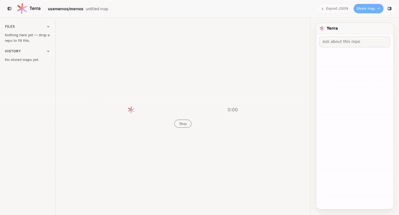

<div align="center">

# Terra

### See the whole codebase. Then ask it anything.

Terra turns any GitHub repository into a readable architecture map — the main
components, how they connect, and the source files that prove it. Then you can
ask the map questions and run the software.

[](https://github.com/Enizri/terra/actions/workflows/check.yml)
[](LICENSE)


<a href="apps/web/public/videos/landing/workspace-demo.mp4">
  
</a>

<sub>Scripted walkthrough of the workspace &middot; <a href="apps/web/public/videos/landing/workspace-demo.mp4">watch the full-quality MP4</a></sub>

</div>

---

## What it does

Drop in a GitHub URL. Terra fetches the repository, scans it without calling a
model, and recommends one. You pick a local model or supply a key for a hosted
one, and Terra streams progress while it builds the map. From there you explore
components and their file evidence, ask questions grounded in the real code, and
start a live preview when the repository and your installed toolchains support it.

Every claim in the map points back at the files it came from, so answers are
traceable rather than invented. Analyses are stored in SQLite and can be reopened.

Nothing here is a wrapper around a chat endpoint: the Go API owns scanning,
storage and previews; a separate Python analyzer owns model work; and they only
speak over an HTTP contract. Models are reached exclusively through
OpenAI-compatible Chat Completions, so local and hosted providers are
interchangeable.

## Quickstart

Run everything from the repository root.

| Prerequisite | Version |
|---|---|
| Go | 1.25+ (exact version in `backend/api/go.mod`) |
| Python | 3.11+ with venv; CI uses 3.12 |
| Node.js | 22.18+ with npm |
| CMake + C++ compiler | Only for the local `llama-cpp-python` runtime |
| Docker with Compose | Optional, for the container stack |

### Fastest path — a hosted model

```sh
cp .env.example .env
```

Set these four values in `.env`:

```dotenv
TERRA_LLM_URL=https://api.openai.com/v1
TERRA_LLM_API_KEY=your-provider-key
TERRA_MODEL=gpt-5.4-mini
HF_HUB_OFFLINE=0
```

Then start the analyzer, API and web UI:

```sh
make venv
./scripts/dev.sh analyzer api web
```

Open <http://localhost:5173/>. The workspace picker asks for your provider key in
the browser; `.env` only configures the fallback for CLI and API requests.

### Fully local — no API key, no network

```dotenv
TERRA_LLM_URL=http://localhost:8020/v1
TERRA_MODEL=Qwen/Qwen2.5-0.5B-Instruct-GGUF/qwen2.5-0.5b-instruct-q4_k_m.gguf
TERRA_LLM_API_KEY=
HF_HUB_OFFLINE=0
```

```sh
make venv-local
make dev
```

`make dev` starts the local LLM on `8020`, analyzer on `8010`, Go API on `8080`
and Vite on `5173`, then opens the UI. The first run downloads and loads the GGUF
weights, so allow time for it. GPU offload needs a llama.cpp build with the
matching accelerator backend. Use `make dev-api` for the same stack without Vite,
and Ctrl-C to stop.

### The environment variables you actually need

Both dev commands load the root `.env`, and it overrides existing shell exports.
Terra reads about forty variables in total — these are the ones that matter for a
first run. The complete table is in [`docs/CONFIGURATION.md`](docs/CONFIGURATION.md).

| Variable | Purpose |
|---|---|
| `TERRA_LLM_URL` | OpenAI-compatible base URL. Default `http://localhost:8020/v1` |
| `TERRA_LLM_API_KEY` | Your provider key. Leave empty for local inference |
| `TERRA_MODEL` | Provider model ID, or the GGUF identifier for local runs |
| `TERRA_TOKEN` | Shared API secret. **Required** once the API binds anything but loopback |
| `HF_HUB_OFFLINE` | `0` allows weight downloads; `1` requires an existing cache |
| `GITHUB_TOKEN` | Optional. Avoids GitHub rate limits on repository fetches |

> **Never commit a populated `.env`.** It is gitignored, and `.env.example` holds
> placeholders only.

### Try it from the CLI

```sh
(cd backend/api && go run ./cmd/terra scan https://github.com/usememos/memos)
(cd backend/api && go run ./cmd/terra map  https://github.com/usememos/memos -o ../../memos.map.json)
```

`scan` reads a GitHub tarball with no local clone and no model call. `map` also
calls the analyzer and stores the result in `terra.db`.

Prefer not to run anything? [`case-studies/memos.map.json`](case-studies/memos.map.json)
is a checked-in map of [usememos/memos](https://github.com/usememos/memos), used by
Terra's own fixture tests.

## Architecture

```text
Browser / CLI / HTTP client
        |
        v
   Go API (:8080) ──────────────► SQLite (terra.db)
   repository scan, map assembly, jobs, storage, preview
        |
        | HTTP: /analyze or /tasks/{name}
        v
   Python analyzer (:8010)
   architecture, qa, agent, editor
        |
        | OpenAI-compatible POST /v1/chat/completions
        v
   Local GGUF server (:8020/v1), or a hosted compatible endpoint
   Local runtime: llama.cpp via llama-cpp-python
```

Go and Python never import each other. The bundled local default is Qwen2.5 0.5B
Instruct Q4_K_M; the workspace catalog offers other local and hosted choices.

## Project status

Terra is pre-1.0 and built in the open. It is honest about what is not finished:

| Not built yet | Details |
|---|---|
| Team collaboration | Shared sessions and concurrent editing are planned. There are no user accounts or per-user permissions |
| Export and sharing | **Export JSON** and **Share map** are disabled placeholders. The CLI and API already return JSON |
| Editing | Workspace Ask is read-only. The analyzer has a separate `editor` task, but there is no Git commit or review workflow |
| Preview support | Depends on the detected app and installed toolchains. The default Compose image cannot run Go/Python previews |

Live preview installs dependencies and executes the analyzed repository's code.
Read [`docs/SECURITY.md`](docs/SECURITY.md) before running an unfamiliar
repository or exposing the stack outside a trusted environment.

## Documentation

| Guide | Contents |
|---|---|
| [`docs/CONFIGURATION.md`](docs/CONFIGURATION.md) | Every environment variable, and the locked-down public demo build |
| [`docs/DOCKER.md`](docs/DOCKER.md) | Compose playground, troubleshooting, and live preview internals |
| [`docs/API.md`](docs/API.md) | Make targets, CLI, HTTP routes, and the model-gate protocol |
| [`docs/ARCHITECTURE.md`](docs/ARCHITECTURE.md) | Module ownership and import rules |
| [`docs/CONTEXT.md`](docs/CONTEXT.md) | Domain terms |
| [`docs/SECURITY.md`](docs/SECURITY.md) | Threat model and safe operation |
| [`packages/contracts/`](packages/contracts/README.md) | Versioned wire schemas and compatibility rules |

## Tests

```sh
make venv          # first-time setup; no GGUF runtime required
go install github.com/golangci/golangci-lint/v2/cmd/golangci-lint@v2.13.2
make check         # contracts, fixtures, Go + Python + web tests, lint
make build-web     # production Vite build, separate from make check
```

`make check` runs contract and fixture validation, Go build and tests, Python unit
tests and harness evals, web logic and component tests, and lint. Python tests
marked `slow` are excluded.

| Suite | Command |
|---|---|
| Go | `make test-go` |
| Analyzer and local LLM | `make test-py` |
| Harness evals | `make eval` |
| Web logic and components | `make test-web` |
| Versioned contracts | `make check-contracts` |
| Golden fixture sync | `make test-fixtures` |
| Live GitHub + LLM | `TERRA_INTEGRATION=1 make test-integration` |
| Compose end-to-end | `TERRA_SMOKE=1 make smoke` |

The live suites fetch repositories and can spend model tokens. A passing default
check does not validate the assembled deployment, preview isolation, or
multi-user behavior.

Branch from **`staging`**, open PRs into **`staging`**, and promote
**`staging` → `main`** after verification. See
[`docs/CONTRIBUTING.md`](docs/CONTRIBUTING.md).

## License

MIT — see [`LICENSE`](LICENSE). Bundled third-party assets retain their own
licenses. The celestial globe model is CC0; its provenance is recorded in
[`celestial-globe-license.txt`](apps/web/public/terra/models/celestial-globe-license.txt).
